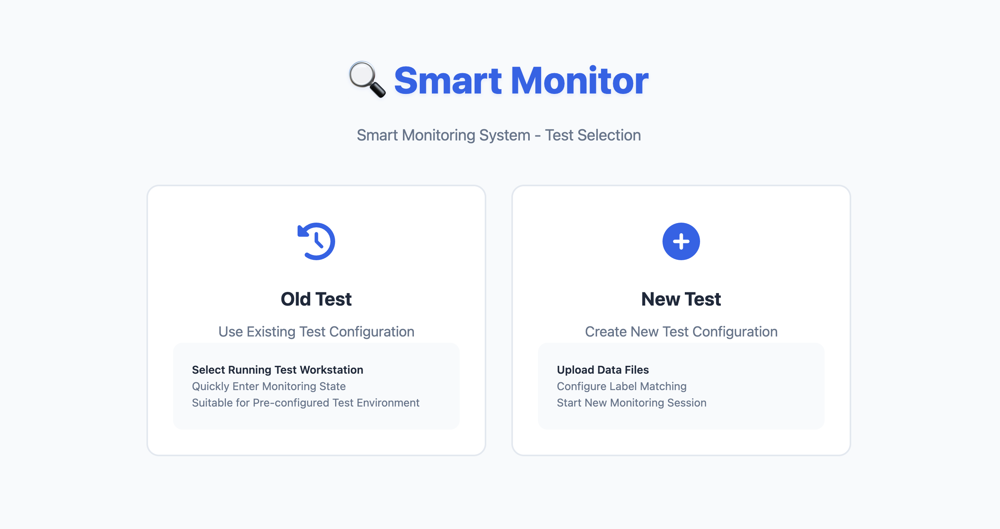
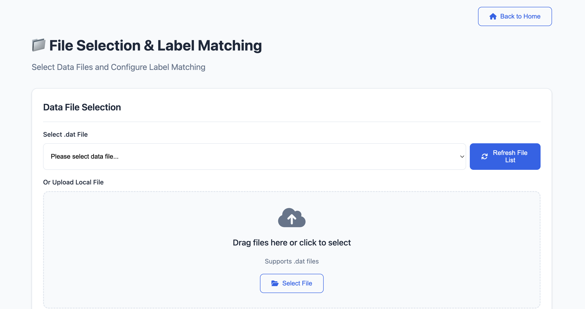
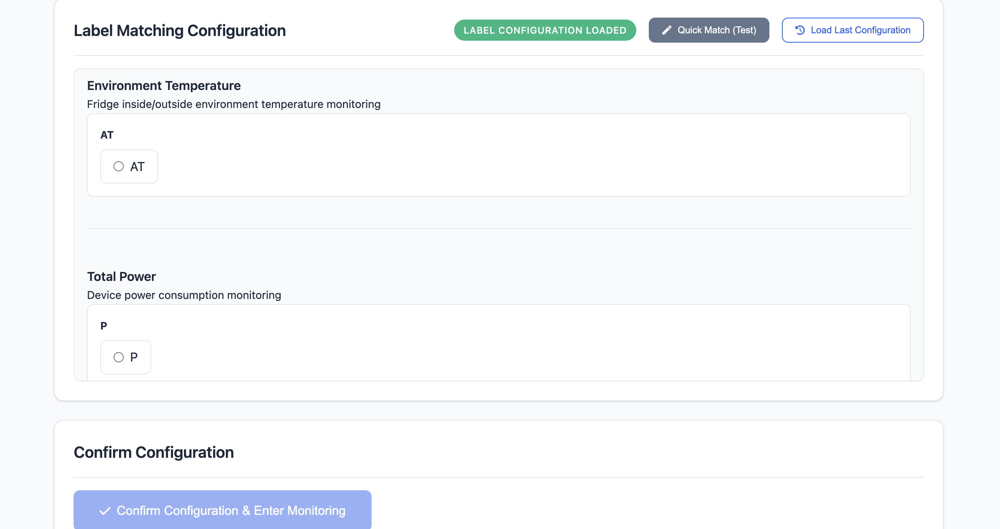
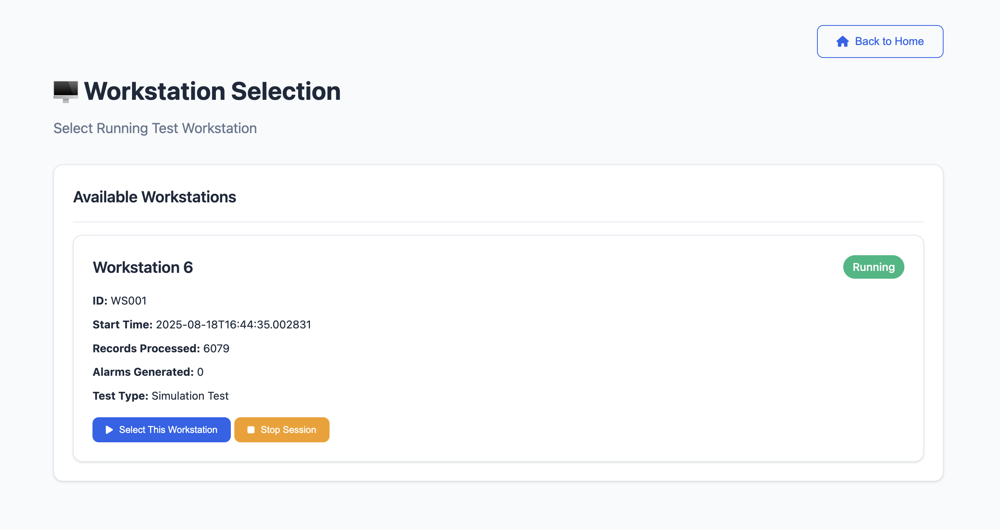
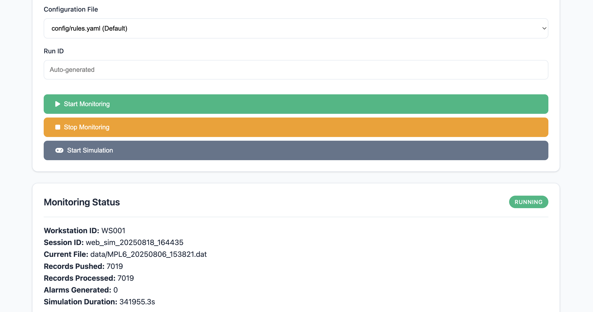

# 智能监测系统 - Web用户手册

## 系统主界面

*智能监测系统Web主界面 - 支持创建新测试和查看历史测试*

### 进入系统
1. 打开浏览器，访问智能监测系统Web地址
2. 系统会显示主界面，包含两个主要选项：
   - **Create New Test** - 创建新测试，用于开启新工作台监控
   - **View Old Tests** - 查看历史测试列表

### 1. 创建新测试 (Create New Test)

#### 操作步骤
1. 点击 **"New Test"** 按钮
2. 系统会跳转到测试配置页面
3. 你需要下拉列表选择`.dat`文件，也可以选择select file进行上传 -> 数据传输打通后，未来会开发成只要选择workstation ID 以及填写一些基本信息即可
3. 按照页面提示完成配置，将channel和labels进行匹配，在全部匹配完之后，点击`confirm configuration & enter monitoring`进入监控台
4. 用户进入监控台后，

### 2. 查看历史测试 (View Old Tests)

#### 操作步骤
1. 点击 **"Old Tests"** 按钮
2. 系统会显示测试历史列表
3. 选择要查看的测试项目，点击`Select this workstation`，或者`stop session`终止并从列表移除这个测试
4. 进入测试项目之后，可以点击`start simulation`进行模拟测试，会从现有.dat文件中一条一条读取数据，模拟每次有新文件被推送过来的过程；目前`start monitoring`还不能使用

## 📊 监控台界面说明

### 测试监控台 (Test Control Panel)

> TODO:目前还分为old test panel和new test panel，未来将统一归为test panel

进入监控台后，你会看到以下主要区域：

#### 文件信息区域
- **当前文件状态**: 显示已选择的.dat文件信息
- **工作站ID**: 自动推断的工作台编号
#### 工作站信息
- **当前工作站**: 显示选中的工作站状态
- **工作站详情**: 显示工作站的基本信息

#### 监控控制区域
- **配置文件选择**: 选择规则配置文件（默认：`config/rules.yaml`）
- **运行ID**: 系统自动生成的测试会话ID
- **控制按钮**:
  - 🟢 **Start Monitoring**: 开始实时监控（功能开发中）
  - 🟡 **Stop Monitoring**: 停止监控
  - 🔵 **Start Simulation**: 开始模拟测试（推荐使用）

#### 状态面板
- **监控状态**: 显示当前监控状态（未开始/运行中/已停止）
- **会话统计**:
  - 开始时间
  - 已处理记录数
  - 告警数量
  - 处理速度（记录/秒）

#### 标签配置显示
- **配置状态**: 显示标签匹配配置状态
- **配置详情**: 显示已配置的通道和标签对应关系

#### 状态和统计
- **监控状态**: 实时显示监控运行状态
- **会话统计**: 显示处理记录数、告警数量等

## 🚨 告警处理流程

### 告警显示

系统会实时显示告警信息，告警表格包含以下列：

| 列名 | 说明 |
|------|------|
| **Time** | 告警触发时间 |
| **Workstation ID** | 工作台编号 |
| **Channel** | 传感器通道名称 |
| **Value** | 当前传感器值 |
| **Threshold** | 触发阈值 |
| **Rule** | 触发的规则名称 |

### 告警严重程度

系统支持多种告警级别：

- 🔵 **Low** - 低级别告警，一般信息提示
- 🟡 **Medium** - 中级别告警，需要注意
- 🟠 **High** - 高级别告警，需要及时处理
- 🔴 **Critical** - 严重告警，需要立即处理

### 告警管理

#### 查看告警
- 告警会实时显示在告警表格中
- 可以查看告警的详细信息和触发条件
- 支持按时间、严重程度等筛选告警

#### 告警操作
- **清空告警**: 点击"Clear Alarms"按钮清空当前告警记录
- **告警确认**: 功能开发中，未来支持确认和处理告警
- **告警导出**: 功能开发中，未来支持导出告警报告

### 日志查看

#### 系统日志
- 实时显示系统运行日志
- 包含监控状态、数据处理进度、告警触发等信息
- 支持清空日志功能
- 目前仅用于测试和开发，未来上线仅保留现实处理后的数据，方便用户回滚查看

## 🆘 常见问题

## 📞 技术支持

### 获取帮助
- **在线帮助**: 查看系统内置帮助文档
- **技术支持**: 联系IT支持团队
- **用户反馈**: 通过系统反馈功能提交问题

### 联系信息
- 联系IT支持团队获取帮助

### 系统更新

- 系统会自动更新，无需手动操作
- 建议定期刷新页面获取最新功能

---

**感谢使用智能监测报警系统！** 🎉

*如有任何问题或建议，请及时联系技术支持团队。* 